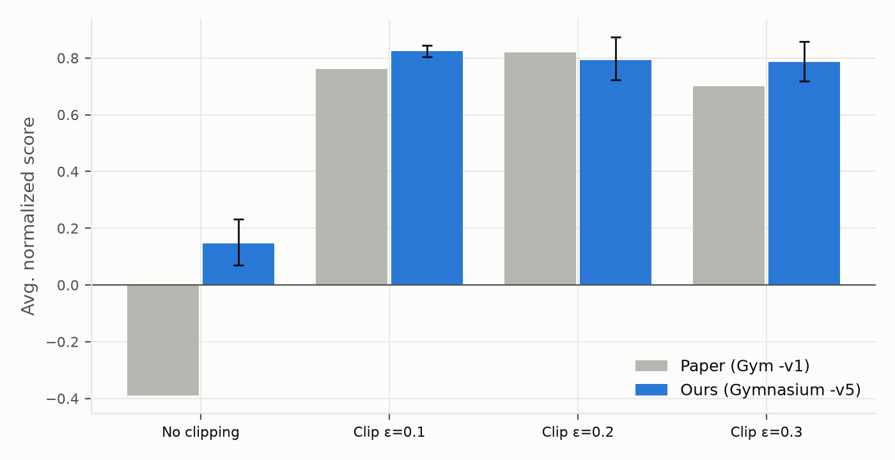
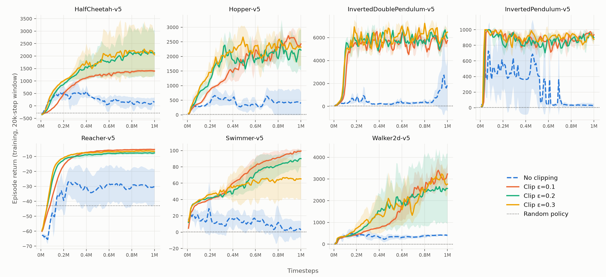
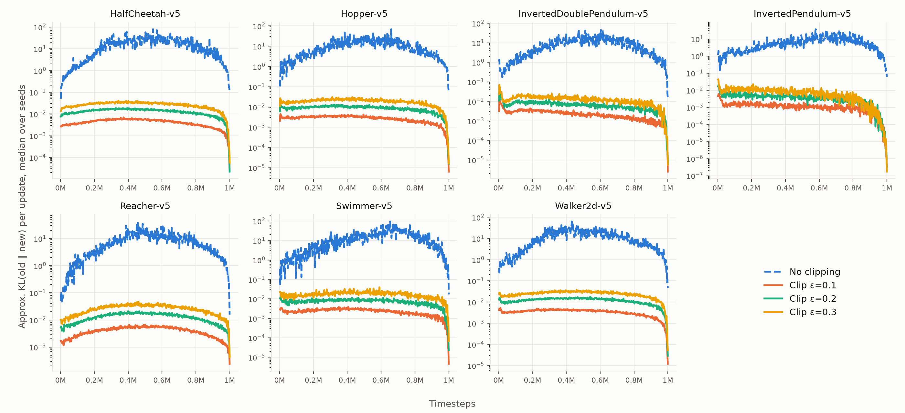

# Reproducing the PPO Clipping Ablation (Schulman et al., 2017, Table 1)

This repository reproduces the **surrogate-objective ablation** from *Proximal Policy Optimization Algorithms* (Schulman et al., 2017). It compares the clipped objective at ε ∈ {0.1, 0.2, 0.3} against the unclipped objective on the paper's seven MuJoCo tasks. Each setting runs for 1M timesteps with 3 seeds, using the hyperparameters in the paper's Table 3.

It was done as a final project for a deep reinforcement learning course.



**Summary.** Three of the paper's findings reproduce:

- The unclipped objective is the worst setting on **every one** of the seven tasks.
- All three clipped settings are far better than the unclipped one, with non-overlapping 95% CIs.
- The clipped settings are close to each other.

Two things differ from the paper:

- **Ranking among the clipped settings.** ε = 0.1 scores highest here, while ε = 0.2 scores highest in the paper. The three clipped CIs overlap, so neither ordering is supported by the data.
- **No-clipping score.** The unclipped objective scores +0.15 here versus −0.39 in the paper.

---

## Paper

> John Schulman, Filip Wolski, Prafulla Dhariwal, Alec Radford, Oleg Klimov. **Proximal Policy Optimization Algorithms.** arXiv:1707.06347, 2017. <https://arxiv.org/abs/1707.06347>

This reproduction uses the arXiv v2 (2017-08-28). The paper is a preprint with no peer-reviewed version. It contains no code, but OpenAI released an implementation the same day in `openai/baselines` (`baselines/pposgd`, commit `da99706`, 2017-07-20). The paper does not say which code version produced Table 1, and this reproduction does not use that release.

### What is reproduced

| Paper element | Paper | This reproduction |
| :--- | :--- | :--- |
| Objectives compared | No clipping or penalty; clipping ε = 0.1/0.2/0.3; adaptive KL (3 settings); fixed KL (4 settings) | No clipping; clipping ε = 0.1/0.2/0.3. **KL-penalty rows not reproduced** |
| Tasks | HalfCheetah, Hopper, InvertedDoublePendulum, InvertedPendulum, Reacher, Swimmer, Walker2d (Gym `-v1`) | Same tasks, Gymnasium **`-v5`** |
| Budget | 1M timesteps, 3 seeds per task | 1M timesteps, 3 seeds per task (84 runs) |
| Network | Separate policy and value MLPs, 2×64 tanh; Gaussian policy, variable std; no entropy bonus | Same; state-independent learnable log-std |
| Score | Mean return of the last 100 episodes → per-task rescale (random = 0, best = 1) → mean over 21 runs | Same, with "best" defined as the best of our 12 runs on that task (see [Normalized score](#normalized-score)) |

### Hyperparameters (paper Table 3)

| Hyperparameter | Value |
| :--- | :--- |
| Horizon T | 2048 |
| Adam step size | 3 × 10⁻⁴ |
| Epochs K | 10 |
| Minibatch size M | 64 |
| Discount γ | 0.99 |
| GAE λ | 0.95 |
| Parallel environments | 1 (not stated in Table 3; standard reading) |

### Implementation details not in the paper

The paper leaves out many code-level details, and they strongly affect results ([Engstrom et al., 2020](#implementation-references-and-related-studies); [Huang et al., 2022](#implementation-references-and-related-studies)). This implementation follows [CleanRL's `ppo_continuous_action.py`](https://github.com/vwxyzjn/cleanrl/blob/master/cleanrl/ppo_continuous_action.py). That file implements the continuous-action details listed by Huang et al. (2022, ICLR Blog Track), and those authors report that their reimplementation closely matches the original `openai/baselines` results on MuJoCo tasks.

- Observation normalization (running mean/std) and clipping to [−10, 10]
- Reward scaling by a running estimate of the discounted-return std, then clipping to [−10, 10]
- Per-minibatch advantage normalization
- Orthogonal initialization (gain √2 for hidden layers, 0.01 for the policy output, 1 for the value output)
- Global gradient-norm clipping at 0.5
- Linear learning-rate annealing to 0
- Adam ε = 10⁻⁵
- Truncation (time limit) treated as termination when bootstrapping, as in baselines and CleanRL

Deliberate deviations from CleanRL:

1. **Value-loss clipping is off.** In CleanRL the value clip reuses the policy's ε. Turning it off means ε changes only the policy objective, which is the quantity the paper ablates.
2. **One plain environment instead of `SyncVectorEnv`.** Gymnasium 1.x changed the vector-env autoreset semantics. With a single environment, a plain env is simpler and handles episode boundaries exactly.
3. **`--clip none`** trains on the unclipped surrogate `r_t(θ)·Â_t` (paper Eq. 6). All other details stay identical, so the ablation changes exactly one thing.

---

## Results

Generated by `analyze.py`. The full tables are in [`results/tables.md`](results/tables.md).

### Table 1: average normalized score (21 runs per setting)

| Setting | Ours | 95% CI | Rank | Paper | Paper rank |
| :--- | ---: | :---: | ---: | ---: | ---: |
| No clipping | 0.15 | [0.07, 0.23] | 4 | −0.39 | 4 |
| Clip ε = 0.1 | 0.82 | [0.80, 0.84] | 1 | 0.76 | 2 |
| Clip ε = 0.2 | 0.79 | [0.72, 0.87] | 2 | 0.82 | 1 |
| Clip ε = 0.3 | 0.79 | [0.72, 0.86] | 3 | 0.70 | 3 |

The CI is a stratified bootstrap with 10,000 resamples: seeds are resampled within each task, then all runs are averaged. With only 3 seeds per task, this interval is optimistic.

### Normalized score per task (mean over 3 seeds)

| Task | No clipping | ε = 0.1 | ε = 0.2 | ε = 0.3 |
| :--- | ---: | ---: | ---: | ---: |
| HalfCheetah-v5 | 0.10 | 0.44 | 0.63 | 0.64 |
| Hopper-v5 | 0.15 | 0.90 | 0.75 | 0.82 |
| InvertedDoublePendulum-v5 | 0.30 | 0.86 | 0.92 | 0.92 |
| InvertedPendulum-v5 | 0.02 | 0.97 | 0.92 | 0.92 |
| Reacher-v5 | 0.35 | 0.99 | 0.93 | 0.95 |
| Swimmer-v5 | 0.03 | 0.97 | 0.87 | 0.64 |
| Walker2d-v5 | 0.08 | 0.65 | 0.53 | 0.62 |

### Raw return, last 100 training episodes (mean ± std over 3 seeds)

| Task | Random policy | No clipping | ε = 0.1 | ε = 0.2 | ε = 0.3 |
| :--- | ---: | ---: | ---: | ---: | ---: |
| HalfCheetah-v5 | −287.2 | 113.1 ± 252.7 | 1407.0 ± 66.2 | 2133.6 ± 1177.6 | 2171.7 ± 1215.8 |
| Hopper-v5 | 18.4 | 425.1 ± 522.1 | 2451.3 ± 182.4 | 2063.9 ± 670.7 | 2252.4 ± 740.0 |
| InvertedDoublePendulum-v5 | 48.6 | 2004.8 ± 3075.4 | 5722.7 ± 207.7 | 6103.5 ± 336.4 | 6115.4 ± 471.7 |
| InvertedPendulum-v5 | 5.3 | 27.2 ± 33.8 | 945.7 ± 32.2 | 897.7 ± 55.3 | 896.7 ± 26.2 |
| Reacher-v5 | −42.9 | −29.7 ± 13.4 | −5.3 ± 0.5 | −7.5 ± 1.1 | −6.6 ± 2.1 |
| Swimmer-v5 | 0.5 | 3.1 ± 13.4 | 98.1 ± 4.4 | 88.1 ± 13.8 | 64.9 ± 29.5 |
| Walker2d-v5 | 1.8 | 400.1 ± 68.1 | 3085.0 ± 604.9 | 2534.2 ± 1906.5 | 2937.0 ± 470.9 |

For reference, CleanRL reports these `-v4` returns (3 seeds, 1M steps, default settings: ε = 0.2, value clipping on): Hopper 2382.86 ± 271.74, Walker2d 2287.95 ± 571.78, HalfCheetah 1442.64 ± 46.03, InvertedPendulum 963.09 ± 22.20.

### Learning curves

Each point is the mean training-episode return over a trailing 20k-step window. Lines are the mean over 3 seeds, and shaded bands are ±1 std. The dotted line is the random policy.



### Diagnostic: how far each objective moves the policy per update

The plot shows the approximate KL(π_old ‖ π_new) per update, using the estimator (r − 1) − log r averaged over all minibatches and epochs. Lines are the median over seeds, on a log scale.



### Observations

1. **Clipping is what keeps updates small.** With 10 epochs on the same batch, the unclipped objective reaches a per-update KL of roughly 1–100 for most of training; it falls back only as the learning rate anneals to 0. The clipped objectives stay near 10⁻³–3×10⁻². Across tasks, the KL increases steadily from ε = 0.1 to 0.2 to 0.3.
2. **The unclipped objective fails on every task.** Its learning curves stall far below the clipped ones. On InvertedPendulum it first learns and then collapses.
3. **The choice of ε within 0.1–0.3 is not resolved by 3 seeds.** The clipped CIs overlap, and per-task winners differ. The paper's gaps (0.76 / 0.82 / 0.70) are of similar size and come without error bars.
4. **No clipping scores +0.15 here versus −0.39 in the paper.** The paper attributes its negative score mainly to HalfCheetah falling below the random policy. Here, no-clipping HalfCheetah stays above random (113 vs. −287). One hypothesis is that the code-level safeguards blunt the damage from over-large updates: advantage normalization, gradient-norm clipping, learning-rate annealing, and reward scaling. Environment version differences could also contribute. **These factors were not ablated here.**
5. **HalfCheetah is bimodal across seeds.** Seed 2 reaches about 3500 at both ε = 0.2 and ε = 0.3, while the other seeds settle near 1450. This drives the large std in those cells and is the main source of uncertainty in the aggregate scores.

### Known differences from the original setup

- **Gym `-v1` with MuJoCo 1.x vs. Gymnasium `-v5` with MuJoCo 3.13.** Model files, reward terms, and termination conditions changed between versions, so raw returns are not comparable to the paper.
- **Different normalization anchors.** The paper's "best result" anchor is not specified, and its raw runs are unavailable. Normalized scores are therefore comparable to the paper only in ranking and relative gaps, not in absolute value.
- **Original code version not identified.** OpenAI's `baselines/pposgd` was released with the paper, but the paper does not state which code produced Table 1. This reproduction adopts the CleanRL conventions listed above.

---

## Reproducing

Requires [uv](https://docs.astral.sh/uv/). All dependencies are pinned in `uv.lock`, and PyTorch is the CPU build.

```bash
uv sync
uv run python random_baseline.py        # -> random_baseline.json (100 episodes per task)
uv run python run_all.py --workers 18   # -> runs/ ; skips runs that already have done.json
uv run python analyze.py                # -> results/
```

A single run:

```bash
uv run python ppo.py --env-id Hopper-v5 --clip 0.2 --seed 1     # --clip none for the unclipped objective
```

**Compute.** CPU only, on an Intel Core Ultra 9 185H laptop with 18 runs in parallel (one thread each). A run took 11–22 minutes under that load, 17 minutes on average; alone it runs at about 2000 steps/s. The full grid took about 24 CPU-hours, or about 1.5 hours of wall time.

**Determinism.** On the same machine and software stack, a run is bit-for-bit reproducible. Three runs (Hopper, HalfCheetah, Walker2d with ε = 0.2 and seed 1) were executed twice, once alone and once inside the parallel grid, and produced identical `episodes.csv` files. Different hardware or library versions may change the results.

**Software.** Python 3.12.14, PyTorch 2.14.0 (CPU), Gymnasium 1.3.0, MuJoCo 3.13.0, NumPy 2.5.3, pandas 3.0.5, Matplotlib 3.11.1.

---

## Repository layout

```text
ppo.py                 single PPO run (clipped or unclipped surrogate)
run_all.py             7 tasks × 4 objectives × 3 seeds, in parallel; resumable
random_baseline.py     random-policy returns (the 0 point of the normalized score)
analyze.py             tables, bootstrap CIs, figures, curves.csv
random_baseline.json   output of random_baseline.py
run_all.log            completion log of the 84-run grid
runs/                  raw per-run data (see below)
results/               aggregated tables and figures (see below)
pyproject.toml, uv.lock
```

## Data description

### `runs/<env_id>/<variant>/seed<N>/`

`variant` is `noclip`, `clip0.1`, `clip0.2`, or `clip0.3`, and seeds are 1–3. That gives 84 directories, each with five files:

| File | Content |
| :--- | :--- |
| `config.json` | All command-line arguments of the run |
| `episodes.csv` | One row per completed training episode |
| `updates.csv` | One row per PPO update (488 updates = 488 × 2048 = 999,424 steps) |
| `done.json` | Run summary, written only when the run finished |
| `stdout.log` | Console output (the summary line) |

**`episodes.csv`**

| Column | Meaning |
| :--- | :--- |
| `global_step` | Environment step at which the episode ended |
| `return` | Undiscounted episode return in **raw** environment reward, recorded before reward scaling |
| `length` | Episode length in steps |

These are training episodes under the stochastic policy, as in the paper's metric. An episode still in progress when training stops is not recorded.

**`updates.csv`**

| Column | Meaning |
| :--- | :--- |
| `global_step` | Environment steps collected so far (end of this update's rollout) |
| `lr` | Learning rate used for this update (after annealing) |
| `policy_loss` | Policy loss on the last minibatch of the last epoch (negated surrogate) |
| `value_loss` | 0.5 × MSE of the value head on that minibatch |
| `entropy` | Mean policy entropy on that minibatch |
| `approx_kl` | Mean over all minibatches and epochs of (r − 1) − log r, an estimate of KL(π_old ‖ π_new) |
| `clipfrac` | Fraction of samples with \|r − 1\| > ε. For `noclip`, ε = 0.2 is used as a reference band |
| `ratio_min`, `ratio_max` | Smallest and largest probability ratio r seen during the update |
| `explained_var` | Explained variance of the rollout value predictions with respect to the GAE returns |
| `sps` | Cumulative average environment steps per second |

**`done.json`**

The fields are `env_id`, `variant`, `seed`, `episodes` (count), `last100_mean_return` (mean `return` of the last 100 episodes, the paper's per-run score), and `wall_time_s`.

### `results/`

| File | Content |
| :--- | :--- |
| `tables.md` | The three tables above |
| `runs.csv` | One row per run: the `done.json` fields plus `norm`, the normalized score |
| `curves.csv` | Columns `env_id, variant, seed, global_step, return_20k_window`: the learning-curve data on a 10k-step grid, as mean episode return over the trailing 20k steps, forward-filled where no episode ended |
| `table1_vs_paper.png`, `learning_curves.png`, `kl_per_update.png` | The figures above |

### `random_baseline.json`

Mean return of a uniform random policy over 100 episodes per task (action-space seed 0).

### Normalized score

For run *i* on task *e*:

```text
norm_i = (R_i − R_random(e)) / (R_best(e) − R_random(e))
```

- `R_i` is the run's `last100_mean_return`.
- `R_random(e)` comes from `random_baseline.json`.
- `R_best(e)` is the maximum `last100_mean_return` over all 12 runs (4 objectives × 3 seeds) on task *e*.

The score of a setting is the mean of `norm_i` over its 21 runs. The best anchor is taken from this reproduction because the paper does not define its own and its runs are unavailable.

---

## References

Peer-reviewed versions are cited where they exist. Metadata was checked on 2026-09-13 against the publishers' pages (PMLR, NeurIPS proceedings, JMLR, ICLR, Crossref).

### Paper reproduced

- Schulman, J., Wolski, F., Dhariwal, P., Radford, A., & Klimov, O. (2017). *Proximal Policy Optimization Algorithms.* arXiv preprint arXiv:1707.06347. <https://arxiv.org/abs/1707.06347>
  - The paper has no peer-reviewed version. OpenAI released an implementation on the same day in `openai/baselines` (`baselines/pposgd`, commit [`da99706`](https://github.com/openai/baselines/commit/da99706046), 2017-07-20).

### Methods the paper builds on

- Schulman, J., Levine, S., Abbeel, P., Jordan, M., & Moritz, P. (2015). Trust region policy optimization. In *Proceedings of the 32nd International Conference on Machine Learning* (PMLR Vol. 37, pp. 1889–1897). <https://proceedings.mlr.press/v37/schulman15.html>
- Schulman, J., Moritz, P., Levine, S., Jordan, M. I., & Abbeel, P. (2016). High-dimensional continuous control using generalized advantage estimation. In *International Conference on Learning Representations (ICLR 2016)*. ICLR 2016 published no proceedings; the conference version is hosted at <https://arxiv.org/abs/1506.02438>.

### Implementation references and related studies

- Huang, S., Dossa, R. F. J., Ye, C., Braga, J., Chakraborty, D., Mehta, K., & Araújo, J. G. M. (2022). CleanRL: High-quality single-file implementations of deep reinforcement learning algorithms. *Journal of Machine Learning Research*, 23(274), 1–18. <https://jmlr.org/papers/v23/21-1342.html>
  - Code: <https://github.com/vwxyzjn/cleanrl>. Its `ppo_continuous_action.py` is the reference implementation here, with benchmarks at <https://docs.cleanrl.dev/rl-algorithms/ppo/>.
- Huang, S., Dossa, R. F. J., Raffin, A., Kanervisto, A., & Wang, W. (2022). The 37 implementation details of proximal policy optimization. *ICLR Blog Track*. <https://iclr-blog-track.github.io/2022/03/25/ppo-implementation-details/>
- Engstrom, L., Ilyas, A., Santurkar, S., Tsipras, D., Janoos, F., Rudolph, L., & Madry, A. (2020). Implementation matters in deep RL: A case study on PPO and TRPO. In *International Conference on Learning Representations (ICLR 2020)*. <https://openreview.net/forum?id=r1etN1rtPB>
  - Code: <https://github.com/MadryLab/implementation-matters>
- Andrychowicz, M., Raichuk, A., Stańczyk, P., Orsini, M., Girgin, S., Marinier, R., Hussenot, L., Geist, M., Pietquin, O., Michalski, M., Gelly, S., & Bachem, O. (2021). What matters for on-policy deep actor-critic methods? A large-scale study. In *International Conference on Learning Representations (ICLR 2021)*. <https://openreview.net/forum?id=nIAxjsniDzg>
- adrische. *Reinforcement Learning: Zero to PPO* (GitHub repository). A step-by-step PPO reimplementation on the same seven `-v5` tasks; not a publication. <https://github.com/adrische/Reimplementing-PPO>

### Software

- Towers, M., Kwiatkowski, A., Balis, J. U., De Cola, G., Deleu, T., Goulão, M., Kallinteris, A., Krimmel, M., KG, A., Perez-Vicente, R., Terry, J., Pierré, A., Schulhoff, S., Tai, J. J., Tan, H., & Younis, O. G. (2025). Gymnasium: A standard interface for reinforcement learning environments. In *Advances in Neural Information Processing Systems 38, Datasets and Benchmarks Track*. <https://doi.org/10.52202/085713-4916>
- Todorov, E., Erez, T., & Tassa, Y. (2012). MuJoCo: A physics engine for model-based control. In *2012 IEEE/RSJ International Conference on Intelligent Robots and Systems* (pp. 5026–5033). <https://doi.org/10.1109/IROS.2012.6386109>
- PyTorch: <https://pytorch.org>

---

## Acknowledgements

The PPO implementation is adapted from CleanRL (MIT License, Copyright (c) 2019 CleanRL developers). The code, experiments, and this README were produced with the assistance of Claude Code (Anthropic). All results come from the runs in `runs/` and can be regenerated with the commands above.

## License

MIT. See [LICENSE](LICENSE).
